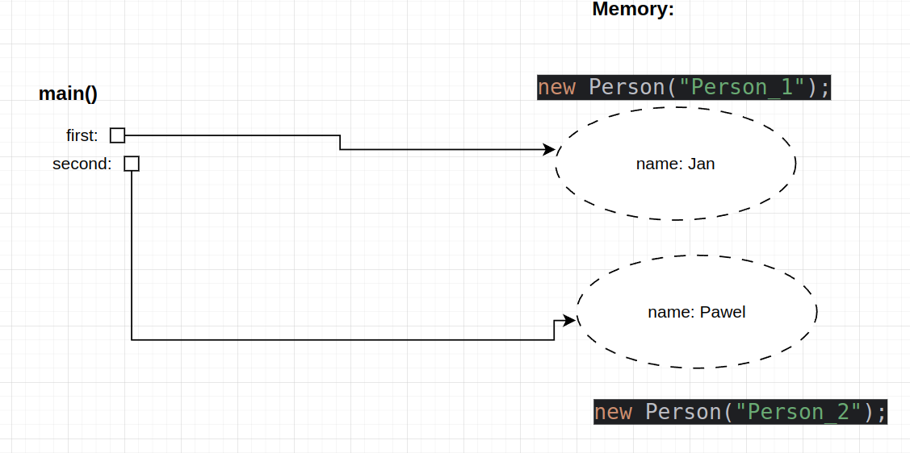
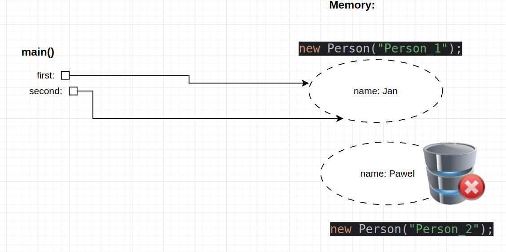
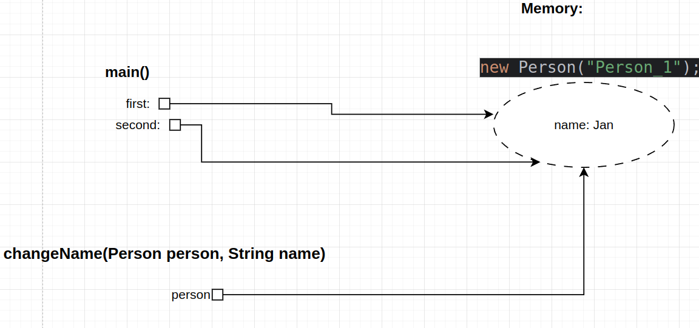

# Fantastyczne PPJ i jak je zdac
###### by J.K. Rowling

_Jako ze test byl podchwytliwy i mial pelno pulapek postanowilem
podsumowac to co bylo / moze sie jeszcze pojawic na egzaminie poprawkowym z ppj_


## 1. Przekazywanie zmiennej referencyjnej do metody

```java
public class PPJ {

    public static void main(String[] args) {
        Person first = new Person("Person_1");
        Person second = new Person("Person_2");
        System.out.println("Person 2 name = " + first.getName());
        System.out.println("Person 2 name = " + second.getName());

        second = first;

        changeName(second, "LOLOLOOLO");

        System.out.println("Person 2 name = " + first.getName());
        System.out.println("Person 2 name = " + second.getName());
    }

    private static void changeName(Person person, String name) {
        person.setName(name);
    }
}
```
### Co się dzieje krok po kroku:

- **Tworzenie obiektów:**
    - `person1` wskazuje na obiekt `Person` z imieniem `"Person_1"`.
    - `person2` wskazuje na inny obiekt `Person` z imieniem `"Person_2"`.



- **Przypisanie referencji:**
    - Po wykonaniu `person2 = person1;` obie zmienne (`person1` i `person2`) wskazują na ten sam obiekt.
    - Wcześniejszy obiekt, na który wskazywał `person2`, zostaje utracony (o ile nigdzie indziej nie jest referencja do niego).



- **Wywołanie metody `changeName`:**
    - Metoda `changeName` otrzymuje jako argument kopię referencji do obiektu, na który wskazuje `person2` (a ten jest taki sam jak obiekt `person1`).
    - Wewnątrz metody, wywołanie `person.setName(name);` zmienia stan obiektu, czyli modyfikuje jego pole `name`.
    - To działanie wpływa na ten sam obiekt, który jest widoczny zarówno przez `person1`, jak i `person2`.



- **Wypisanie wyników:**
    - Zarówno `person1.getName()` jak i `person2.getName()` zwrócą teraz zmienioną wartość `" LOLOLOOLO"`, ponieważ obie referencje wskazują na obiekt, którego stan został zmodyfikowany.

### Kluczowe punkty

- **Przekazywanie referencji przez wartość:**
    - Metoda `changeName` dostaje kopię referencji do obiektu.
    - Modyfikacja stanu obiektu (poprzez `setName`) zmienia obiekt, na który wskazuje referencja.

- **Współdzielenie obiektu:**
    - Po przypisaniu `person2 = person1;` obie zmienne wskazują na ten sam obiekt.
    - Dlatego zmiany dokonane na obiekcie przy użyciu jednej referencji są widoczne przy użyciu drugiej.

## 2.  Przekazywanie zmiennej prymitywnej

```java
public class PrimitiveTest {
    public static void main(String[] args) {
        int a = 5;
        System.out.println("Przed: a = " + a);
        changeValue(a);
        System.out.println("Po: a = " + a);
    }
    
    public static void changeValue(int x) {
        x = 10;
        System.out.println("W metodzie: x = " + x);
    }
}
```

Wynik to:
```
Przed: a = 5
W metodzie: x = 10
Po: a = 5
```

### Co się dzieje krok po kroku:

- **Tworzenie zmiennej:**
  - Zmienna `a` typu `int` jest inicjalizowana wartością `5`.

- **Wywołanie metody `changeValue`:**
  - Metoda `changeValue` otrzymuje kopię wartości zmiennej `a` (czyli `5`).

- **Modyfikacja kopii:**
  - W metodzie `changeValue` zmienna `x` (kopiowana wartość) zostaje zmieniona na `10`.
  - Zmiana ta dotyczy tylko kopii, a nie oryginalnej zmiennej `a`.

- **Wypisanie wyników:**
  - Po powrocie do metody `main`, zmienna `a` nadal ma wartość `5`, ponieważ nie została zmodyfikowana przez metodę.

## 3.  Zadanie z fileWritter

```java
import java.io.FileOutputStream;
import java.io.IOException;

public class FileWriteTest {
  public static void main(String[] args) {
    int[] numbers = {100, 255, 257, 512};
    try (FileOutputStream fos = new FileOutputStream("output.bin")) {
      for (int number : numbers) {
      fos.write(number); // Zapisuje tylko 8 najmniej znaczących bitów (czyli te najbardziej "prawostronne") !!!!!!!!! wazne
      }
    } catch (IOException e) {
      e.printStackTrace();
    }
  }
}
```
### Pytanie:
Jaki ciąg bajtów (w postaci liczb dziesiętnych) zostanie zapisany do pliku output.bin?

- A) [100, 255, 257, 512]

- B) [100, 255, 1, 0]

- C) [100, 1, 255, 0]

- D) [100, 128, 1, 0]

Wynik to:
```
Odczytane bajty: 100 255 1 0 
```

### Co się dzieje krok po kroku:

Metoda `write(int b)` zapisuje tylko 8 najmniej znaczących bitów przekazanej liczby. Oznacza to, że niezależnie od tego, ile bitów ma dana liczba (np. 32-bitowy `int`), zapisywany jest jedynie jej fragment – ostatnie 8 bitów, czyli te znajdujące się najbardziej po prawej stronie.

### Jak to działa:

- **Reprezentacja liczby jako 32 bity:**
  - Każda liczba typu `int` w Javie ma 32 bity.
  - Możemy ją zapisać w postaci:
    ```
    [B31 B30 ... B8] [B7 B6 ... B0]
    ```
    gdzie:
    - **[B31 B30 ... B8]** – 24 najstarsze (bardziej znaczące) bity.
    - **[B7 B6 ... B0]** – 8 najmniej znaczących bitów.

- **Operacja maskowania (przycinania bitów):**
  - Można wyobrazić sobie, że stosujemy "maskę bitową", która usuwa wszystkie bity poza 8 ostatnimi.
  - Ta operacja "przycina" liczbę do jej 8 najmniej znaczących bitów, które zostaną zapisane.

## Analiza dla poszczególnych liczb:

- **100:**
  - Liczba 100 mieści się w 8 bitach.
  - Jej 8-bitowa reprezentacja to:  
    `01100100`
  - **Zapisana wartość:** `100` (wszystkie 8 bitów pozostaje bez zmian).

- **255:**
  - Liczba 255 to maksymalna wartość, którą można przedstawić w 8 bitach.
  - Reprezentacja w 8 bitach to:  
    `11111111`
  - **Zapisana wartość:** `255`.

- **257:**
  - Reprezentacja liczby 257 w 32 bitach (skupiając się na dwóch ostatnich bajtach) może wyglądać jak:
    ```
    ... 00000001 00000001
    ```
  - Po "przycięciu" pozostają tylko 8 najmniej znaczących bitów:  
    `00000001`
  - **Zapisana wartość:** `1`.

- **512:**
  - Reprezentacja liczby 512 w 32 bitach (patrząc na dwa ostatnie bajty) może być zapisana jako:
    ```
    ... 00000010 00000000
    ```
  - Po wycięciu pozostają tylko 8 bitów:  
    `00000000`
  - **Zapisana wartość:** `0`.

## Podsumowanie

- Metoda `write(int b)` "przycina" przekazaną liczbę do jej 8 najmniej znaczących bitów.
- Dla liczb `{100, 255, 257, 512}` zapisane zostaną odpowiednio:
  - `100` → `100`
  - `255` → `255`
  - `257` → `1`
  - `512` → `0`
- Wynikowy ciąg bajtów zapisany do pliku to: **[100, 255, 1, 0]**.


## 4. this vs this()

|  Słowo kluczowe	 | Opis  |   Przykład|
| ------------ | ------------ | ------------ |
|  this |  Odwołuje się do bieżącej instancji klasy	 | this.name = name;  |
|  this()	 |  Wywołuje inny konstruktor w tej samej klasie | his("Domyślna nazwa", 0);  |


## 1. this()
✔ Pozwala na wywołanie innego konstruktora w tej samej klasie.

✔ Pomaga w unikaniu duplikacji kodu.

✔ Może być używane do inicjalizacji domyślnych wartości w konstruktorach.


### WAZNE
✔ Jezeli jest uzywany musi być pierwszym wyrażeniem w konstruktorze.
```java
class Example {
  int x;

  Example() {
    System.out.println("Konstruktor domyślny");
    this(10); // BŁĄD! this() musi być pierwszą instrukcją
  }

  Example(int x) {
    this.x = x;
  }
}
```

#### Przyklad przeciazania kostruktorw (Overloading)

Przeciążanie konstruktorów pozwala na tworzenie wielu konstruktorów z różnymi zestawami parametrów.

```java
class Person {
  String name;
  int age;

  // Konstruktor 1 (domyślny)
  Person() {
    this("Nieznany", 0); // Wywołuje konstruktor 2
    System.out.println("Konstruktor bez parametrów");
  }

  // Konstruktor 2
  Person(String name) {
    this(name, 0); // Wywołuje konstruktor 3
    System.out.println("Konstruktor z jednym parametrem: " + name);
  }

  // Konstruktor 3
  Person(String name, int age) {
    this.name = name;
    this.age = age;
    System.out.println("Konstruktor z dwoma parametrami: " + name + ", " + age);
  }
}

public class Main {
  public static void main(String[] args) {
    Person p1 = new Person();
  }
}

```
Wynik:
```
Konstruktor z dwoma parametrami: Nieznany, 0
Konstruktor z jednym parametrem: Nieznany
Konstruktor bez parametrów

```

## 2. this

Słowo kluczowe `this` odnosi się do bieżącego obiektu. Jest szczególnie przydatne, gdy nazwy parametrów metody lub konstruktora pokrywają się z nazwami pól klasy. Dzięki `this` możemy jednoznacznie odnieść się do pól obiektu.

### Przykład kodu

```java
public class Car {
    private String model;
    private int year;
    
    // Konstruktor, w którym nazwy parametrów są takie same jak pola klasy
    public Car(String model, int year) {
        // Użycie 'this' do przypisania wartości do pól obiektu
        this.model = model;
        this.year = year;
    }
    
    public void printDetails() {
        // 'this' odnosi się do bieżącego obiektu i jego pól
        System.out.println("Model: " + this.model + ", Year: " + this.year);
    }
    
    public static void main(String[] args) {
        Car car = new Car("Toyota", 2020);
        car.printDetails();  // Wypisze: Model: Toyota, Year: 2020
    }
}
```

## 5. super vs super()